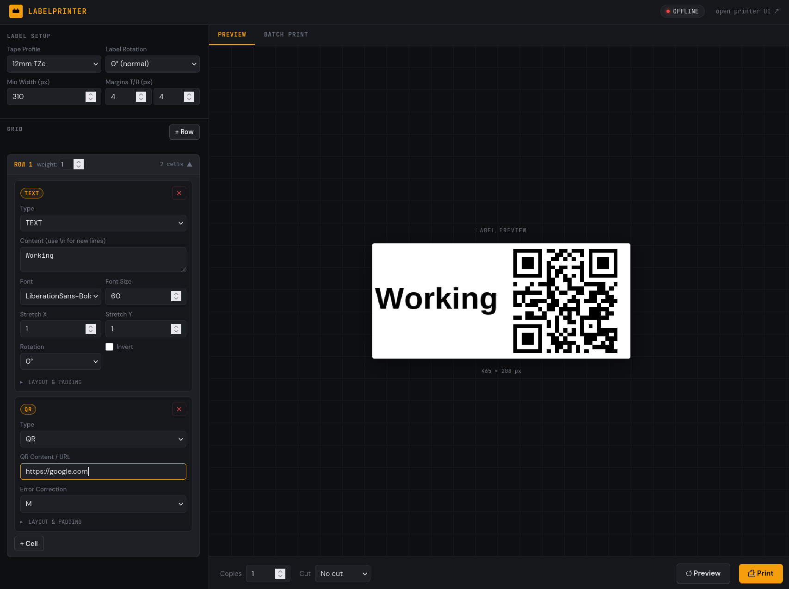
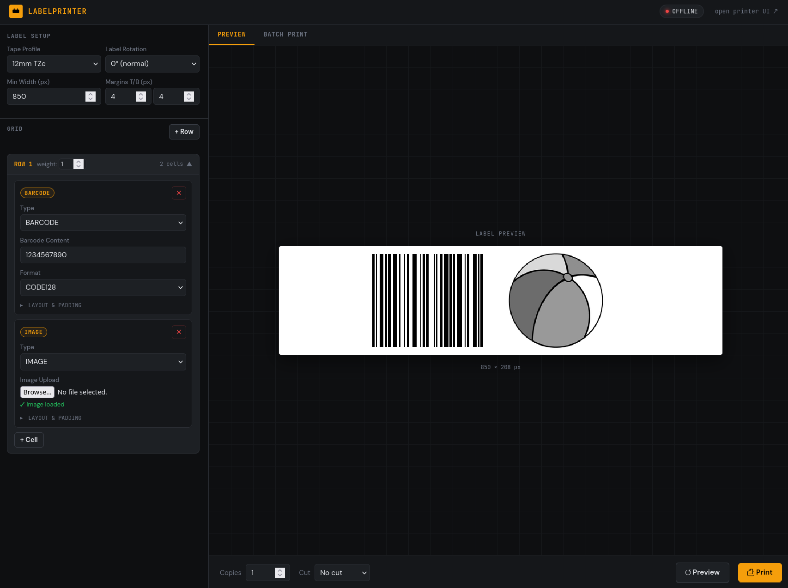

# labelprinter

Web-based label designer and printer UI for Brother P-touch printers.

## Features

- Grid-based layout: rows and columns with proportional weights
- Text cells: font picker, size, stretch X/Y, rotation, alignment, invert
- QR code cells: content + error correction level
- Barcode cells: Code128, Code39, EAN13, EAN8, and UPCA
- Image cells: upload PNG/JPEG
- Accurate live preview
- Batch printing: paste a list or JSON array, print all with one click
- Printer status display
- Tape profiles: configurable stripe sizes per tape type in `profiles/tapes.json`

## Quick start

```bash
# Create a .env file defining "PRINTER_IP" and "PRINTER_PORT"
docker compose up --build -d
```

Then open: http://localhost:8765

## Configuration

### Printer IP and PRINTER_PORT
Set `PRINTER_IP` and `PRINTER_PORT` in `.env` or pass as environment variable.

### Tape profiles
Edit `profiles/tapes.json`. The key fields are:
- `stripe_size`: total printable dots across the tape width (measure/calibrate per printer)
- `width_mm`: tape width, sent to printer in init packet
- `dpi`: informational only
- `printer_media_code`: code for printer's specific loaded tape type
- `y_offset`: specific value to ensure label is centered

The profiles volume is mounted read-only so you can edit without rebuilding.

## Calibrating stripe_size

If text is clipped at the top or bottom, the `stripe_size` in `profiles/tapes.json`
needs adjustment. Print a full-height solid rectangle and measure. The stripe size
in dots = tape_printable_width_mm × (dpi / 25.4).

For the PT-9800PCN at 360 DPI:
- 12mm tape: 208 dots
- 18mm tape: 312 dots
- Other sizes: extrapolate and calibrate

## Project structure

```
labelprinter/
├── docker-compose.yml
├── Dockerfile
├── data/
│   └── templates/          # Custom pre-made templates
│   └── tapes.json          # Tape size configs
├── backend/
│   ├── main.py             # FastAPI routes
│   ├── models.py           # Pydantic label spec
│   ├── renderer.py         # PIL label renderer
│   ├── printer.py          # Brother raster protocol + network send
│   └── requirements.txt
└── frontend/
    └── index.html          # Single-page UI
    └── styles.css
    └── app.js
```

## Screenshots


